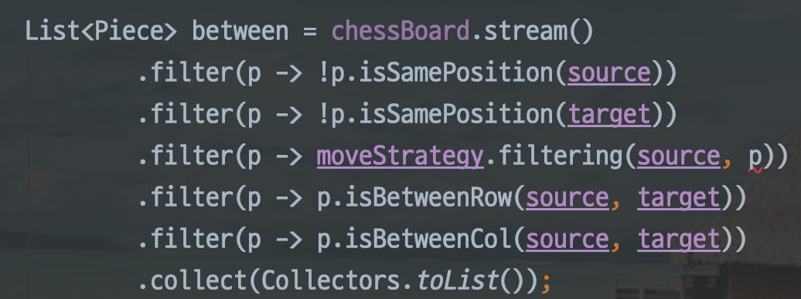

## 면담

> 1기 때 어떤 크루는 페어를 만날 때마다 장점을 흡수하더라고요. - 씨유

레벨1 첫 면담 때 씨유코치가 제게 해준 말입니다. 고개가 끄덕여졌어요. 우아한 테크코스(이하 우테코) 기간 동안 많은 페어를 만날 텐데, 그들의 장점을 흡수한다면 우테코가 끝났을 때 훨씬 더 성장해있을 것 같다는 생각이 들더라고요. 사람마다 갖고 있는 장점이 다르기 때문에 혼자였으면 배우지 못할 점도 많을 것 같다고 생각했어요. 그 당시 첫 페어 프로그래밍을 진행하고 있어서 바로 실천에 들어갔습니다.

마침 제 첫 페어는 장점이 많은 사람이었어요. 기술적으로 많이 알았고, 친화력도 있고 배려심도 많았지요. 특히 아는 것을 잘 설명해 주는 것이 인상 깊었어요. 평소에 설명을 잘하고 싶었기 때문에 이 장점을 어떻게 흡수할까 고민했습니다. 그리고, 저를 위한 콘텐츠를 하나 제작했지요.

## 미션 속의 미션

배운 것은 써먹어야 의미가 있다고 하잖아요? 계산기와 자동차 경주 같은 미션 말고, 이전 페어의 장점을 적용해보자는 저만의 미션을 추가로 적용했습니다. 바로 '아는 것을 잘 설명해 주기 미션'이죠. 마침 제 두 번째 페어는 그때 당시 소통에 있어서 수동적이었기 때문에 전 페어의 장점을 적용해볼 수 있는 꽤 좋은 기회라고 생각했어요. 미션을 하면서 사소한 부분까지 아는 것을 전부 설명해주려고 했습니다. 설명하다가 말문이 막히면 빈백에 누워 근거를 찾아보기도 했어요. 이 과정을 수행하면서 살짝 충격을 받았어요. '내가 모르고 쓰는 코드가 이렇게 많았구나...' 하고요. 미션 마지막을 향해 갈수록 다른 크루들이 하나둘씩 페어를 깨기 시작했습니다. 설명해주는 과정이 힘들긴 했지만, 의미 있다고 생각해서 조금 더 이어가자고 제안했어요. 감사하게도 제 페어는 수용력이 좋고 이해심도 많은 페어였죠. 많이 친해지기도 해서 흔쾌히 수락해주더라고요. 끝까지 미션을 마무리했고, 이렇게 첫 번째 미션 속의 미션이 막을 내립니다.

미션 속의 미션을 하다 보니 부가적으로 얻는 이익이 있더라고요. 크루들의 장점을 찾게 됩니다. 평소에 평범하다고 생각했던 크루가 좋은 크루가 되고, 별로라고 생각했던 크루의 단점이 장점으로 메꿔집니다. 이런 선순환을 통해 제 주변엔 뛰어난 크루들밖에 없는 최고의 환경이 마련되었습니다.

이후에도 다양한 장점을 가진 페어들과 미션을 진행했습니다. 밝은 에너지를 가진 페어, 기록을 잘하는 페어, 지식 습득력이 빠른 페어, 도메인 설계를 잘하는 페어... 근데 이상했습니다. 분명 듣기론 1기에선 페어끼리 갈등이 생기기도 하고 혼자 할 때보다 생산성이 떨어지기도 한다는데 늘 제 역량 이상의 결과물이 나왔거든요. 왜 그럴까 곰곰이 생각해봤습니다. 두 가지 이유가 있더군요.

- 페어의 좋은 설계 제안을 받아들일 순 있지만 내가 먼저 제안할 역량은 없다.
- 미션 중 다른 크루들의 설계와 구현에 대해 인사이트를 얻고 반영한다.

이로 인해 다음 미션 속의 미션 주제가 정해졌습니다.

## 남의 말 안 듣기

이번 미션 속의 미션은 '남의 말 안 듣기'였어요. 옆에서 다른 크루들의 좋은 설계와 구현을 주워들어도 꿋꿋하게 기존 방법대로 가는 것이죠. 다른 인사이트 없이 얼마나 할 수 있을까 궁금하더라고요. 그런데 이번 미션은 지옥의 체스미션이라고 하네요. 아뿔싸! 시기를 잘못 잡았습니다. 차라리 잘됐다고 생각하고, 어려운 미션인 만큼 어느 정도 실력의 바닥을 찍는 것을 각오한 채 미션에 임했죠. 평소에 미션을 잘 수행해서 바닥이 깊지 않을 거라고 생각했습니다. 아니더라고요. 바닥을 찍은 것이 모자랐는지 지하를 뚫고 들어갔습니다. 자신감은 날로 떨어졌고 가장 부끄러운 코드가 탄생하게 됩니다.

<i>부끄럽지만 이런 코드도 있었습니다. 코웨이 5중 필터, 미세먼지가 걸러진 스트림이라고 하더라고요😭</i>

시간이 흘러 의기소침해진 채로 미션을 마무리하게 됩니다. 마침 레벨 1이 마무리되는 시점이라 개인적인 회고를 진행했어요. 미션은 성공적이지 못했지만 미션 속의 미션은 성공했습니다. 근데 이상하게도 뿌듯하지 않더라고요. 오히려 '나 이거 왜 했지?'라는 생각이 들었습니다. 맞아요. 괜히 했습니다. 이렇게 할 거면 우테코에 오지 않아도 됐습니다. 잘 꾸려놓은 최고의 환경을 철저하게 이용 안 하는 바보 같은 짓을 한 겁니다.

## 핑프

'핑프'라는 신조어를 아시나요?

> 핑프는 핑거 프린세스(finger princess), 또는 핑거 프린스(finger prince)의 준말이다. 핑거 프린세스/프린스는 간단한 정보조차 스스로 조사하는 것을 귀찮아하는 사람들로, 이들은 사이트 게시판에 수시로 질문을 올려 타인이 달아준 댓글을 통해 정보를 습득하고자 한다. - 네이버 국어사전

저는 핑프를 좋아하지 않습니다. 핑프가 되고 싶지도 않고요. 궁금한 게 생겨도 최대한 혼자 해결하는 것이 좋다고 생각해요. 하지만 우테코에선 아니더라고요. 왜 막히는 부분을 혼자 낑낑대야 하죠? 체스 미션 도중 옆에서 크루들이 좋은 설계와 구현을 했는데 왜 꿋꿋하게 기존 방법대로 가야 하죠? 혼자서 생각했으면 하루, 일주일 혹은 한 달이 지나도 더 좋은 방법을 생각해내지 못할 수도 있어요. 하지만 웃으면서 질문 한 번만 하면, 핑프가 되어버리면, 어느 레퍼런스보다 친절한 설명과 함께 좋은 인사이트가 됩니다. 

네. 우테코에서 찾은 저만의 효과적인 공부법은 바로 핑프되기 입니다. 학습하다가 막히는 부분이 있을 때, 고민해봐도 해결법이 떠오르지 않을 때 핑프가 되어 질문합니다. 1시간은 족히 검색해야 얻을 수 있는 지식이 10분 안에 전달됩니다. 정말 극한의 이득이지요. 이것이 가능한 건 지식을 나누는 것을 좋아하고, 열정이 넘치는 50명의 크루들이 주변에 있기 때문입니다. 아주 든든합니다!

핑프가 될 때 주의할 점이 있습니다. 질문해서 얻은 지식을 무조건 수용하면 안 됩니다. 충분히 장단점을 고려한 뒤 합리적이라고 생각하는 부분만 수용해야 하죠. 그래야 본인만의 역량을 기를 수 있습니다. 그리고 크루들의 기분과 상황을 살피는, 눈치라는 소프트 스킬이 요구됩니다. 감사하게도 제 주변의 크루들은 궁금한 걸 물어보면 누구보다 적극적으로 설명해주고 해결해주려고 합니다. 정말, 정말 고맙고 소중합니다.

## 감사

크루들에게 전합니다. 고마워요. 저에게 다가와 줘서, 기분을 살펴줘서, 힘들 때 술 한잔 같이해줘서, 못하는데 잘한다고 해줘서, 모르는 부분을 알려줘서. 저 역시도 그런 사람이 되도록, 감사함에 익숙해지지 않도록 노력해볼게요.

당신이 내향적이든 외향적이든 중요하지 않아요. 잘하든지 못하든지 별로 중요하지 않아요. 감사하게도 저는 사람의 장점을 잘 찾을 수 있는 능력이 있습니다. 덕분에 당신이 모르는 사이에도 저는 많은 것을 배우고 있어요.

사실 조금 걱정이었어요. 이렇게 낯간지러운 말들을 실컷 적어놓고 대면하는 것은 쑥스러우니까요. 쑥스러울 일 없이 감사함을 전하지 않는것과, 쑥쓰럽지만 감사함을 전하는 것, 두 개에 대한 트레이드 오프가 있었는데 후자가 이겼습니다. 압도적으로요. 감사함이 커서 조심스럽게 전하고 싶었습니다. 제발 만나서 내색하지 말아 주세요.🙏🏻

아이러니하게도 공부법이 주제인 글이 감사함으로 끝을 맺네요. 어쩌면 포비와 코치님들이 크루들과 잘 지내라는 것도, 어쩌면 1기가 남긴 편지에 크루들과 잘 지내라는 말이 그렇게 많은 것도, 어쩌면 우아한 형제들이 잡담이 경쟁력이라고 말하는 것도, 일맥상통하는 것이 아닐까요?

어쩌면 아이러니가 아이러니지 않을 수도 있겠네요.

