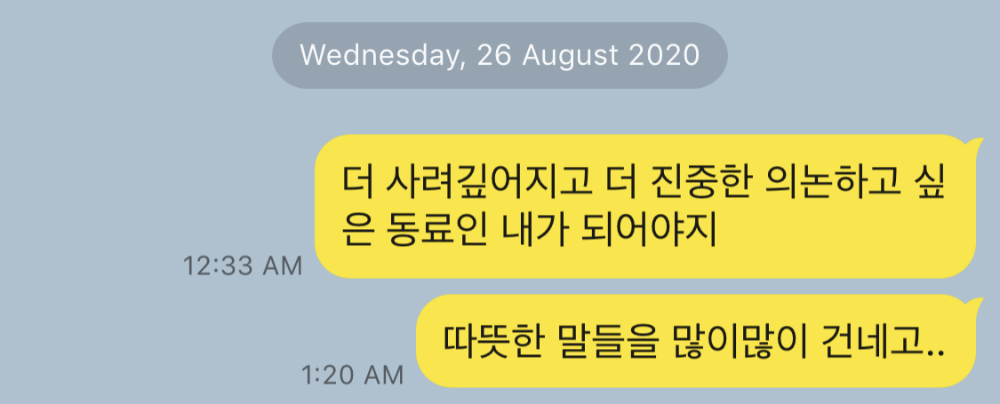

# 내가 꿈꾸는 프로그래머로서의 삶

안녕 예지! 여기는 지금 우아한테크코스 수료를 한 달 정도 남긴 2020년의 10월이야.

자고 일어나니까 첫 문장부터 오글거리지만 언젠가 이 글을 찾을 널 위해 쭉 이어 써 내려 가보기로 해 ㅎㅎ (고맙지?)

너는 2020년을 어떻게 기억할까?

사회에 나가서 본격적으로 일을 시작하기 전에 운 좋게 우테코에 합격해서 좋은 환경에서 공부할 기회를 가졌잖아.

그래서 지금 이 시점에서는 올해를 '내가 앞으로 개발자로 살아갈 날들을 위한 준비 시간'이라고 말할 수 있을 것 같아.

당연하게도 우테코에 몸을 담근 기간 동안 내가 어떤 개발자가 되고 싶은지 꿈꿀 수 있던 시간이 무수히 많았었어.

공부를 하다가 문득, 프로그래밍을 하다가 문득, 옆에 크루들을 지켜보다가 문득, 책을 읽다가 문득, 코치님들과 포비의 말을 듣다가 문득...

이곳에서의 소중한 깨달음들과 소중한 다짐들을 네가 잊지 않고 있길 바라지만,

혹시 그 마음들이 조금이라도 바래져 있을까봐 이렇게 편지를 쓰게 되었어.

상기시키기 위한 말 혹은 당부의 말 몇 마디 적을게.

 

우선은 '소프트웨어 장인'이 되도록 늘 노력하고 있길 바라.

'소프트웨어 장인'이라는 단어를 처음 접했을 땐 '장인'이라는 단어가 굉장히 거창하다고 생각했는데,

우테코에서 배우는 시간 동안 프로그래머도 충분히 '장인'이 될 수 있다는 걸 알게 되었어.

장인이 되는 건 온전히 **너의 마음가짐**에 달렸을 거야.

좋은 개발에 대한 욕심과 의지를 갖자.

단순히 주어진 할 일을 끝냈다는 것에 만족하지 말고 수준 높은 결과물을 내려고 노력하고, 너만의 개발 철학을 가지려고 노력해.

프로그래밍 역량뿐 아니라 업무를 다양한 방면에서 장악하고 있고, 적극적으로 의견을 내어 늘 새로운 가치를 만들어내려고 노력하자.

그러려면 일에 들이는 시간과 노력도 중요할 거야. 얼마 전에 책에서 인상 깊게 읽은 말이 있지.

현재 나에게 무엇을 투자했느냐가 미래의 나를 결정한다고. 습득한 지식이나 능력은 복리로 이자가 붙기 때문에 차이는 점점 커질 거라고.

잊지 않고 바지런히 매일매일의 전문성을 쌓아나가며 성장하길 바라.  학습도 좋고 사이드 프로젝트도 좋겠다.

개발자로서 자부심을 느끼며 주도적으로 일을 해나간다면 훨씬 자유롭고 만족스럽게 일을 할 수 있을 거야.

제이슨이 공유해준 피어 리뷰 문서에서 영향을 많이 받았네. 혹시 잘 기억이 안 난다면 다시 읽어봐도 좋을 거야.

 

함께 일하고 싶은 개발자가 되기 위한 노력도 잊지 않고 있겠지?

함께 하고 싶은 개발자가 되기 위해 크게 두 가지 방면에서 노력해 볼 수 있을 것 같아.

첫 번째는 기술적으로 함께 성장하는 것에 대한 부분이야.

우테코에 와서 '함께 자라기'의 장점과 중요성을 많이 느꼈지?

같이 공부하면서 서로 동기부여가 되어주기도 하고, 서로의 부족한 부분을 서로가 채워주며 역량이 같이 향상될 수도 있고..

우테코에서 그랬듯 혼자 공부하는 것보다 훨씬 크게 성장할 수 있는 것 같아.

사람들과 함께 스터디를 하거나, 여러 창구로 다양한 방식으로 소통하려는 노력을 들이면 좋겠어.

너도 네가 알고 있는 부분들로 필요한 사람들에게 도움을 줄 수 있으면 좋겠다.

뭐든 간에 어떤 방식으로든 많이 공유하려고 노력하자! 새롭게 알게 된 점이나 답이 나오지 않는 부분이나..

그러려면 설명도 잘해야 될 거야! 명확하고 쉽게 설명하기 위한 연습도 하면 좋겠네.

두 번째는 사람들과의 관계 자체야.

우테코에 있으면서 감사하게도 많은 사람들에게 '함께 해서 일을 편안하고 즐겁게 할 수 있었다'라는 평을 들었어.

피드백에 관해 생각하다가 짧게 메모를 남겼었어.

여기에 덧붙여 일할 때 남들도 느낄 수 있는 좋은 기운을 뿜어내는 사람이 되었으면 해.

팀을 뛰어나게 만드는 압도적인 변수는 '심리적 안전감'이고, 신뢰 자산이 높은 조직은 효율과 생산성이 높아진다고 하네.

사람들하고 좋은 관계를 맺는다면 팀의 분위기도 좋아지고, 다 같이 일할 때 시너지 효과를 낼 수 있을 거야.

'혼자 가면 빨리 가지만, 함께 가면 멀리 간다.'라는 말 정말 맞는 말 같아!

 

마지막으로는 너의 일을 즐기고 있으면 좋겠어.

처음 파이썬으로 별을 찍고 뿌듯해하던 날이 기억나는지 모르겠네. 첫 컴공 수업들 들으며 즐거움에 눈이 반짝이던 날들도.

그리고 좋은 개발자가 되고 싶다는 간절함 하나로 우테코에 지원해서 10개월 성장의 시간도 보냈어.

그 시절들을 잊지 말고 좋아하는 일을 업으로 삼는 것에 항상 감사하며 일을 즐기고 있으면 좋겠다.

일을 즐기는 것도 의식적인 노력이 필요한 것 같아!

민석이 오빠가 그랬잖아 자기는 우쿨렐레를 일로 대하지 않으려고 항상 의식적으로 거리를 두고 즐기려고 한다고.

일을 하다 보면 무슨 일이든 무뎌지고 초심을 잃는 순간이 올 텐데, 의식적으로 스스로를 다잡자.

마음먹기에 따라 무엇이든 의미를 찾아내고 재미를 찾아내고 즐길 수 있는 것 같아.

즐거움이 네가 일을 지치지 않고 꾸준히 해나갈 수 있는 원동력이 되어줄 거야.

결국은 행복한 게 제일 중요하잖아!ㅎㅎ 제일 중요한 걸 잊지 않았으면 좋겠다.

 

삶은 여정이라고 하지?

업무적인 일이든 업무 외적인 일이든 아무리 사소해 보이는 일이라도 항상 최선을 다하며 순간순간을 후회없이 살고 있길 바라.

무슨 일이든 최선을 다하면 결국에는 너한테 좋은 결과로 돌아올 거야.

그리고 방금 말한 모든 것들을 지키기 위해 규칙적으로 생활하고 운동하면서 건강 챙기는 것도 잊지 말구 (!!!)

쓰다 보니까 이런 많은 깨달음들을 얻게 해 준 우테코에도 고마워진당 ㅎㅎ

글을 읽으면 각자의 자리에서 최선을 다하고 있을 포비나 코치님들, 크루들한테도 한 번씩 연락해봐.

그곳에서 개발자로 일하는 너도 눈이 반짝반짝거리길 바라며.. 그럼 이만 줄일게!
