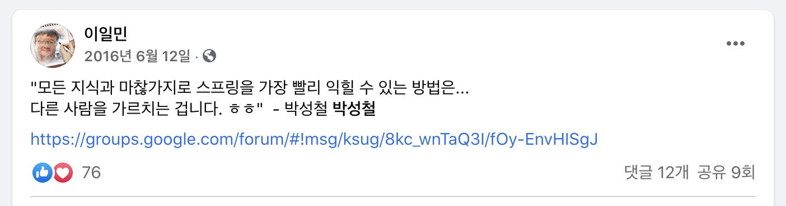
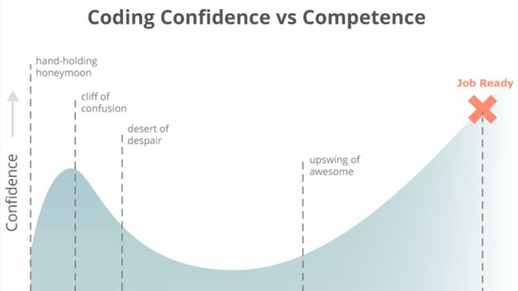

# 레벨 2: 우테코에서 찾은 나만의 효과적인 공부법

## 프로그래밍을 배운지는 3년째 됩니다만

나는 컴퓨터공학과 거리가 다소 있는, 경영학 전공생이다. 다전공이 소프트웨어벤처학이긴하지만, 컴퓨터학과 수업을 들을 기회는 딱히 없었다. 2017년에 비전공자 대상 프로그래밍 교육 동아리인 ***[멋쟁이 사자처럼](https://likelion.net/)*** 이라는 동아리에서 처음으로 프로그래밍을 접했다. 정말 단순한 이유로 프로그래밍에 관심을 가졌었는데, 카페에서 맥북을 켜고 어두운 화면에서 알록달록한 글씨로 무언가를 멋있게 쓰는 누군가를 보았기 때문이다. 여하튼 그렇게 시작한 프로그래밍 학습이 어느덧 3년째다.

## 2017, 실패

결론부터 말하면, 2017년의 학습은 실패했다. 프로그래밍을 정말 단순한 이유로 접근해서였는지 꿈꿨던 멋진 프로그래머의 모습에는 한순간도 가까워질 수 없었다. HTML/CSS까지는 어떻게 괜찮았다. 그런데 Ruby를 배우기 시작하며 반환(`return`)과 출력(`puts`)의 차이를 이해하는 데서 막혔다. 그리고 난 프로그래밍 체질이 아닌가 봐 하고 포기했다. 해커톤도 몇 번 나갔는데, HTML/CSS만 부분만 건드리고 Ruby, Ruby on Rails가 들어가는 부분에 대해서는 거부감을 느끼며 학습할 엄두도 내지 않았다.

JavaScript보다 jQuery를 먼저 써봤다. Stack Overflow 답변 글을 복사해서 붙여넣기만 해보았으니 배웠다기보단 써봤다가 맞는 표현이겠다. 다른 사람들이 복잡하게 잘 써놓은 코드니 되면 좋고 아니면 말자는 생각으로 시도해서 스스로 이해하지 못하는 코드들을 정말 많이 사용했다. 물론 이해하려고 노력하지도 않았다. 그렇게 처음으로 배운 프로그래밍은 나한테서 멀어져만 갔다.

## 2018, 교육

그랬던 내가 정신을 차려보니 동아리 다음 기수 대표가 됐다. 아는 것이 없는 상태로 후배들을 가르쳐야 한다는 현실에 놓이자, 어떻게든 쪽팔림을 면하기 위해 공부를 시작했다. 전년도에 교육에 쓰인 강의안들을 몇 번이고 읽으며 외우고, [웹 개발 인터넷 강의](https://www.udemy.com/course/the-web-developer-bootcamp/?utm_source=adwords&utm_medium=udemyads&utm_campaign=WebDevelopment_v.PROF_la.EN_cc.ROW_ti.8322&utm_content=deal4584&utm_term=_._ag_80385735315_._ad_437497334061_._kw__._de_c_._dm__._pl__._ti_dsa-774930035449_._li_1009871_._pd__._&matchtype=b&gclid=Cj0KCQjwz4z3BRCgARIsAES_OVcF0daCWbXiePO_O3AsRCYr-jnebkRdW8aBUCex4gIn_MUx4JqycmEaAvF7EALw_wcB)를 수강하며 유사한 커리큘럼을 준비했다. 쪽팔림을 면하기 위한 공부라고 앞서 말했는데, 정말 남들 앞에서 바보가 되는 자신의 모습은 죽기보다 싫었고 그 이유로 준비 기간 두 달 내내 하루 평균 14시간씩은 공부만 했다. 짧은 기간 내에 무언가 다양한 지식을 머릿속에 넣었고, 자신감은 최고조가 되었다. 후배들이 들어올 때 즈음 커리큘럼은 얼추 준비되었고, 이제 암기한 지식을 전달할 때가 되었다.

*토비님이 인용하신 문구를 또 인용하기 (팬이예요!)*

대학을 다니며 그 흔한 과외 한 번 해보지 않았고, 남들에게 무언가를 가르치는 것은 처음이라 아주 두려웠다. 1년이라는 시간은 길었지만, 다 생략하고 결론만 말하자면, 무언가를 가르치는 일을 통해 더 많이 성장했다. 오히려 어렵다고 느껴지는 부분들을 후배들에게 쉽게 설명하려고 노력할 때 진정 이해하게 된 것들이 많았다. 실습 과제를 설계하며 직접 먼저 풀어보다가 그동안 몰랐던 부분을 깨닫고, 그제야 작년에 복사-붙여넣기 하던 많은 코드가 얼추 어떻게 동작하는지도 파악할 수 있었다. 그렇게 프로그래밍 공부에 다시 흥미를 갖게 되었다. 이 기세를 몰아 두 개의 스타트업에도 뛰어들어 보고, 문제가 생기면 해결하면 된다는, 자신감에 기반한 단순한 생각으로 공부하며 많이 성장했다.

## 2019, 슬럼프

자신감을 가지고 부딪히며 공부하다 보니 어느 순간 막혔다. 딱히 이유가 없었다. 그냥 막혔다. 공부할 수록 내가 찾아보는 강의들과 블로그 글에서는 더 많은 정보를 얻기 힘들었다. 자만하는 것이 아니고, 완전 코딩을 모르는 생초보를 위한 자료들은 정말 많지만, 이를 응용하고 더 나아가기에는 적당한 자료를 찾기 점점 더 힘들어졌다. 컴퓨터 공학 전공 공부를 안 해봐서 그런가하는 생각이 들어 전공생들에게 기초라고 하는 자료구조나 컴퓨터구조 책을 찾아보기도 했는데, 너무 어려워서 도중에 포기했다. 

*포비가 우테코 정신교육(?) 때 자주 사용하는 차트. 2019년의 나는 desert of despair 부분에 있었다.*

남들은 뭔가 다 잘하고 있는데, 나만 천천히 가는 느낌이 강하게 들어 정말 내 길이 아닌가 하는 생각도 들었다. 어떻게든 될 거라는 생각으로 프론트엔드 개발자로 취직을 준비했지만, 코딩 테스트에서 모두 막혔다. 좌절감에 진로에 대해 고민을 하던 11월, 우아한테크코스(이하 우테코) 2기 모집 공지를 보게 되었다. 1년을 더 투자할 정도의 가치가 있는지 정말 많이 고민하다가 지원했고, 프리코스를 거쳐 본 과정에 무사히 입과했다.

## 2020, 성장

돌이켜보면 이전까지 혼자 프로그래밍을 공부할 때나 남들을 가르칠 때, 시간에 쫓긴다는 압박감에 무언가 깊게 공부해본 적은 없었다. 실용주의 마인드를 가진다는 핑계로 모든 학습에 있어 가성비를 따지고, 슬슬 가성비가 떨어진다 느끼는 순간부터 학습에 대한 투자를 많이 줄였다. 2월부터 4월까지 진행된 우테코 레벨1 때 필독서 목록을 줬는데, 지금까지 내가 주로 공부했던 것은 기술 사용법에 대한 자료와 달리 철학, 디자인 패턴, 기술 소개에 관련된 자료들이 많았다.

*우테코 레벨1 필독서 목록. 이 중에 SQL을 제외한 책에서는 기술 사용법을 가르쳐주지 않는다.*

제목들을 보니 내 기준에서는 가성비가 굉장히 떨어지는, 다소 추상적인 책들뿐이었는데, 우선 필독서라 하니 무작정 읽었다. 마침 코로나 사태 때문에 2주 휴강을 하게 되었는데, 그 사이에 우테코에서 주어진 미션은 잠깐 제쳐두고 대부분의 책을 읽을 수 있었다. 책을 읽을 때 뭔가 번뜩이며 영화같이 지식의 지평이 넓어지지는 않았다. 하지만 그래도 참고 책을 다 읽고, 레벨 1 미션들을 무사히 수행하며 레벨 2 과정에 들어섰다.

우테코에서는 정답을 제시하지 않는다. 가끔은 정말 갑갑할 정도로! 너네 알아서 공부하라는 마인드로 던져지는 미션들을 진행하다 보면 내가 무엇을 하고 있는지 혼란스러울 때도 간혹 있다. 그런데 레벨 2에 와서 미션들을 진행하며 어느덧 성장한 자신을 보게 되었다. 어떤 부분에서 제일 많이 바뀌었을까?

### 기술의 존재 의미에 집중하기

이전에 프론트엔드 공부를 할 때는 무작정 취업 시장에서 유리하다는 React와 Vue를 공부했었는데, 단 한 번도 기술의 배경이 되는 철학을 보지 않았다. 어떤 부분에서 써야 하는지도 모른 채 무작정 Hype 하다고 하니 적용했을 뿐이다. 한편 여기서 두 달 내내 객체지향과 Java만을 공부하다 Spring Framework를 공부하기 시작하니, 지금까지 무의미하다 느꼈던 철학들이 내게 다시 다가와 깨달음을 주었다. 이래서 객체지향이 필요하구나, 이래서 디자인 패턴을 알아야 했다는 것을 느꼈다. 놀랍게도, 이런 철학이나 의미에 집중하는 것이 실용적인 기술을 사용하는 데에 있어 학습 곡선을 완만하게 해주는 일등 공신이 되었다. Spring Data JDBC던 JPA던 우테코에서 새로운 기술을 익힐 때도 이 기술이 왜 필요하고 어떤 철학에 기반해서 만들어졌는지를 생각하며 공부를 하게 되니 학습에 있어 많은 장애물이 쉽게 사라졌다.

### 집단지성 활용하기

이전에도 교육을 통해 성장하는 경험이 있어서인지, 여기서도 함께 성장하는 데에 많은 초점을 맞추게 되었다. 우테코에서 공부를 하며 제일 좋은 점은 아마 주변에 같은 고민을 하며 함께 배우는 크루들이 있다는 것이 아닐까? 같은 미션을 진행하고 각자 공부를 하며 몰랐던 것은 알려주고, 실수에 많은 시간을 쏟지 않도록 해결법을 공유하고, 작동 원리에 관해 토론하는데 우리는 정말 많은 시간을 쏟는다. Slack 질문방에서 크루들이 열띤 토론을 벌이는 것을 구경만 해도 새로운 것을 배워갈 수 있고, 우리의 미션이나 과제에 밀접한 질문이다 보니 깨달음을 주는 경우도 부지기수다. 서로 코드 리뷰를 하며 개선점을 제시해주고, 설계에 대해서도 서로의 주관을 가지고 주장하다 보면 두 명 모두 자신도 모르게 성장하고 있는 모습을 볼 수 있다. 같은 목표를 향해 달려갈 때 서로 친구이자 스승이자 제자가 되는 이런 집단 속에서 공부할 수 있다는 것은 앞으로도 함께 공부하고 성장하는 것의 중요성을 잊지 않게 해주는 소중한 경험이 되지 않을까 싶다.

## 오늘도 성장하자

친한 크루들과 입버릇처럼 하는 말이다. 다소 오글거릴 수 있어도, 실제로 입 밖에 내는 것만큼 스스로 동기를 부여와 자극을 주는 더 좋은 방법이 없다. 이제 레벨 2가 끝나는 시점에서 어느덧 우테코도 절반이 끝났는데, 이전보다 여유도 어느 정도 생기고 취업을 목표로 삼기보다는 인간으로서, 프로그래머로서의 성장에 더 큰 의의를 두게 된 것이 내가 제일 크게 변하게 된 것이 아닐까 생각해본다. 역시나 오글거리지만, 적당한 문구와 함께 이번 글을 마무리해본다.

> 중요한 것은 목표를 이루는 것이 아니라, 그 과정에서 무엇을 배우며 얼마나 성장하느냐이다. (It's not what you get. It's what you become that matters. - Andrew Matthews)
