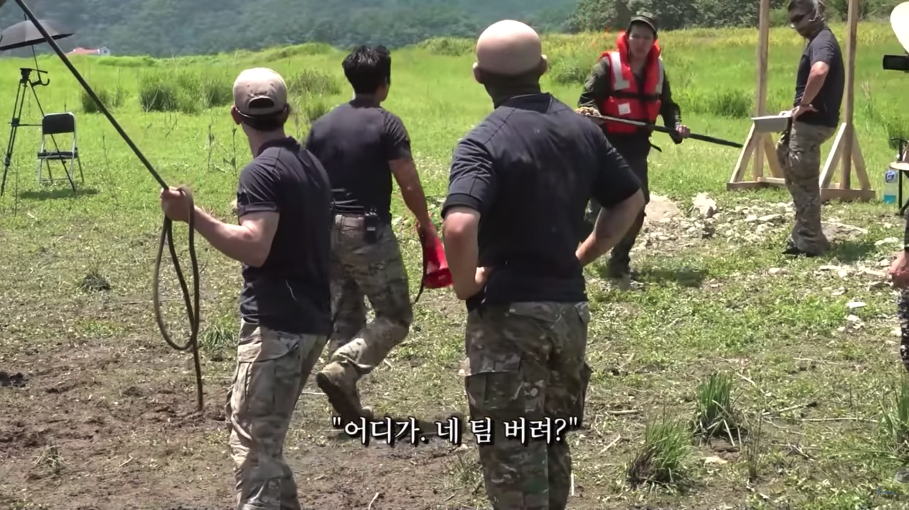

# 팀을 효과적으로 버리는 5가지 방법

전공 특성상 대학 때 팀 프로젝트를 많이 했다. 많은 사람이 그렇듯 팀 프로젝트를 진행하며 성과를 떠나 전체 과정이 좋은 기억으로 남은 경우는 적었다. 대학에서 그랬듯 약 3~4주간의 팀 프로젝트라면 이전처럼 행동했을지도 모르겠다. 하지만 두 가지 큰 차이점이 있었다.

- 레벨 3와 레벨 4 내내 팀 프로젝트가 긴 기간 동안 진행된다. (약 23주)
- IT 업계에 있는 이상 우테코 크루들은 앞으로도 오래오래 볼 확률이 높다.

훌륭한 이유는 아닐지 몰라도, 이번 팀 프로젝트에 임하는 자세가 이전과 같진 않아야 한다는 것은 분명했다.

레벨 2 막바지에 3주간 프로젝트 기획을 한 끝에, 운 좋게 10개 주제 안에 선정되어 팀장 역할을 맡았다. 그래서 이번에는 팀 프로젝트에 임할 때 새로운 방식으로 접근해봤다. 잘하려고 노력하기보단, **"이건 진짜 좀..." 만 피하자**는 것이다. 나를 비롯해 주변 스타트업, 친구들이 겪었던 이야기를 바탕으로 **팀을 효과적으로 버리는 5가지 방법**에 대해 소개한다.

---

## 문제가 생기면 무엇이든 내가 해결한다.

> 호돌과 운장은 같은 팀에 속해있다. 호돌이 기능을 구현하기 위해선 운장이 맡은 이슈가 해결되어야 하는데, 확인해보니 운장이 맡은 이슈가 다소 더뎌졌다. 그래서 호돌은 운장의 이슈를 본인이 해결한 후 기능을 모두 구현했다.

각각 프로덕트에 대해 생각하는 것이 다르고, 팀원마다 능력이 다르기 때문에 그 속도나 퀄리티에서 차이가 나는 것은 당연하다. 하지만 제일 중요한 것은 팀의 성과다. 그러므로 팀의 성과를 위해서라면 내가 필요한 기능은 다른 사람이 맡기로 했더라도 내가 더 빠르게 잘 할 수 있다면 하는 게 맞다. 물론 이에 대해 소통할 시간에 코드 한 줄을 더 짜는 게 효율적이다. 다른 팀원의 프로덕트에 대한 Ownership도 사라지게 할 수 있고, 팀에 대한 소속감과 신뢰도 덤으로 없애줄 수 있다. 팀 프로젝트 마지막에 기여도를 코드 줄 수로 측정해서 서로 비교하며 생색까지 낸다면 금상첨화일 것이다.

## 팀원들과 사적 대화는 불필요하다.

> 호돌은 늘 공과 사를 구별해야 한다는 생각이다. 그래서 팀 프로젝트에 있어 팀원들과 사적인 대화를 나누는 것은 불필요하다 느낀다. 운장이 어제 의견 충돌에 있어 다른 팀원의 발언 때문에 속상하다 느낀다길래 공적 영역에 사적인 대화를 끌어오지 말라고 주의를 줬다.

공과 사를 나누라는 말이 있다. 개인의 감정은 사적이니 일의 진척에 있어 무의미하다. 누군가 다른 사람 때문에 상처를 받았다면 그것은 그 사람이 알아서 혼자 해결해야 하는 것 아닐까? 팀원들끼리 회고할 때 누군가 자신이 힘들다고 한다면 힘내라는 한 마디로 대화를 끝내주자. 어제 무슨 일을 했고, 오늘 무슨 일을 할지에 대해서만 설명한다면 회의 시간은 극적으로 줄어들 것이고, 일할 시간은 많아질 것이다. 물론 다른 팀원들이 공감 능력 없는 당신과 다음 주에도 함께할지는 모르겠지만.

## 현학적 표현이나 권위자의 의견을 인용해 팀원들을 설득한다.

> 호돌과 운장은 운영 환경을 설계하는 중에 의견 차이가 생겼다. 호돌은 운장에게 스택오버플로우, 수많은 블로그 자료들의 링크를 카톡으로 넘겨주었다. 그리고 최근 몇 주간 공부했던 유튜브 채널에서 배운 어려운 용어들을 사용하며 현업에서 사용된다고 들은 방식을 설파했다.

전문적인 용어를 사용할수록 **있어빌리티**(얼마나 "있어 보이는지"에 대한 척도로 쓰이는 신조어)는 강화된다. 특히 팀원들이 경험이 적거나 경력이 없다면, 그들의 의견은 대체로 신뢰도가 떨어진다. 유튜브, 대학강의에서 들은 지식을 총집합해서 팀원들의 무지를 일깨워주자. 유명한 블로거나 책의 저자들이 한 말을 근거로 설명해줘도 효과가 뛰어나다. 팀원이 당신에게 그게 무슨 말인지 잘 모르겠다고 설명을 더 요구할 수도 있다. 하지만 당신이 몇 달, 몇 년간 배웠던 지식을 요약해서 알려주기엔 시간도 없고, 불공평하지 않은가? 알아서 찾아보라고 하자.

## 다수결의 원칙을 절대적으로 따른다.

> 호돌, 운장, 짱돌은 기능 구현 중 두 개의 라이브러리 사이에서 고민하게 되었다. 호돌과 짱돌은 본인들에게 익숙한 A를 사용하자 했다. 운장은 둘 다 사용해보지 않았지만, B가 학습곡선도 낮아 보이고 셋 모두가 편하게 사용할 수 있을 것 같아 B를 주장했다. 호돌과 운장은 다수결에 따른 선택을 하자 했고, 그 결과로 A를 사용하기로 했다.

민주주의는 얼마나 아름다운가! 의견이 갈릴 때 다수결의 원칙을 적용하면, 모두를 만족시키지 못하더라도 합리적이고 신속한 의사 결정이 가능하다. 팀원 모두가 의견을 나누고 만장일치로 무언가에 합의를 보기 전까지 회의한다면 날이 샐지도 모른다. 5명이 서로를 설득하기 위해 3분씩만 이야기해도 15분이라는 긴 시간이 흐른다! 소수 의견이 맞을지도 모른다고? 다수는 늘 옳다는 믿음을 가져라. 시간이 지나고 다수가 틀렸다 한들, 그때 가서 모두가 함께 책임지면 된다.

## 팀원끼리는 편하게 지내는 것이 최고다.

> 호돌은 잠이 많아서 지각을 자주 하는 편이다. 아침 회의에 늦기도 하지만, 다 같은 팀이고 소중한 사람들인데 1~2분 가지고 뭐라 할 매정한 사람은 없을 것이다. 저녁에 회식이 있었는데, 생각해보니 친구와 선약이 있었다. 내일도 볼 사람들이니 오늘 회식 정도야 내일로 미뤄도 되겠거니 생각했다. 예의가 없다고? 우리가 남이가!

팀원들끼리 오래 볼수록 친구라는 느낌도 강해진다. 친구들끼리는 원래 조금씩 실수도 하고 약속도 어기고 하더라도 이해해주지 않나? 설마 내일도 다음 주에도 얼굴 봐야 할 텐데 쓴소리를 한다면, 그 사람의 사회적 능력이 부족한 것이다. 가끔 팀원들이 웃으며 농담으로 당신에게 예의가 없다거나 선을 넘는다고 말할지도 모른다. 농담일 텐데 당신도 함께 웃어넘기면 유쾌한 사람이라는 이미지를 가져갈 수 있다. 혹시 누군가 웃지도 않고 진지하게 화를 낸다면, 화목한 팀 분위기를 해치는 팀원이 더 큰 잘못을 한 것 아니냐 되물어봐 주자.

---

_팀원들과 [가짜 사나이 시리즈](https://www.youtube.com/watch?v=t33uVfNqnP0&list=PLA92lMlT0Ro_4YAewaif0ePASyuve9Sa5)를 재밌게 보았다. 그 덕에 팀플레이에 있어 좋은 정신이 깃든 것 같다. (농담)_

이렇게 나를 비롯해 다양한 사람들이 겪거나 들었던 팀을 효과적으로 버리는 5가지 방법에 관해 설명해보았다. 이상적인 팀 문화를 꾸리는 것은 어렵지만, 선을 지키는 것은 상대적으로 쉬운 방법이다. 우리 팀에는 다행히 (아직 이 글을 읽고 실천에 옮긴 사람이 없어서 그런지) 8주 동안 즐거운 분위기 속에서 꾸준히 훌륭한 성과를 내고 있다. 앞으로도 이 글의 내용을 몸소 실천할 사람은 없길 바라며, 있더라도 최소한 나랑은 같은 팀이 안 되길 바라며 글을 마무리한다.
