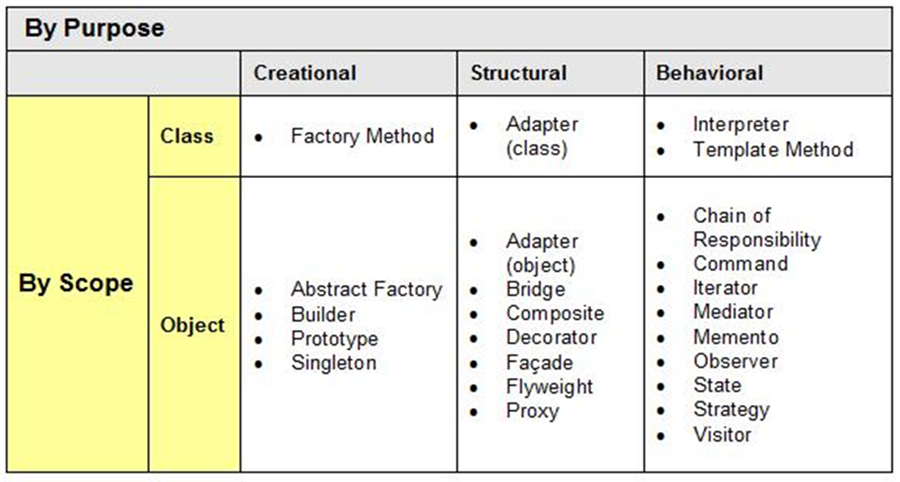

# 예술가가 되고 싶은 프로그래머
## 내가 꿈꾸는 프로그래머로서의 삶

> 해커와 화가의 공통점은 우선 그들이 둘 다 무언가를 창조한다는 사실이다. 작곡가, 건축가, 작가와 마찬가지로 해커와 화가는 좋은 무엇을 만들어내기 위해서 노력한다. 그들은 연구를 수행하지는 않지만, 창조의 과정에서 훨씬 좋은 새로운 기술을 발견하기도 한다.

우아한테크코스에서 읽은 책 중 제일 감명 깊게 읽은 책 중 하나인 [해커와 화가](https://www.hanbit.co.kr/store/books/look.php?p_code=B6957684739)에 나오는 구절이다.

### 부모님께선 건축학을 전공하셨다. 

그에 비해 학창 시절에 수학과 과학에 싫증을 내던 나는 신학을 공부하다 경영학을 전공했다. 그러다가 우연히 프로그래밍을 배우게 되었다. 처음 프로그래밍을 배울 때 제일 걱정했던 것은 "수학과 과학을 잘 못 하는 내가 컴퓨터를 할 수 있을까?" 였다. 물론 소프트웨어 엔지니어로 취업을 준비하고 있는 지금, 돌이켜보니 그런 걱정들은 모두 기우였다.

우아한테크코스에서 디자인 패턴이라는 것을 배웠다. 디자인 패턴은 객체 지향 프로그래밍 설계를 할 때 자주 발생하는 문제들을 피하고자 사용되는 패턴으로, 의사소통 수단의 일종이다. 문제 해결의 제안에 있어서 “기능마다 별도의 클래스를 만들고, 그 기능들로 해야 할 일을 한 번에 처리해주는 클래스를 만들자.”라고 제안하는 것보다 "Facade 패턴을 써보자."라고 제안하는 쪽이 이해하기 쉽다. 전 세계 수많은 선배 프로그래머들의 노하우라고도 할 수 있다.

*디자인 패턴은 오랜 기간에 걸쳐 만들어지고 있는 업계 선배들의 노하우다.*

부모님과 이야기를 하던 중 디자인 패턴에 관한 이야기가 나왔다. 디자인 패턴이라는 용어를 이미 알고 계셨다. 왜 그런가 하니 이 단어는 건축학 영역에서 처음 쓰였다고 한다. 결국, 아무리 발버둥 쳐도 자식은 부모를 닮을 수밖에 없었다. 그래서 내가 꿈꾸는 프로그래머의 삶 역시 건축학을 공부하신 부모님의 삶과 유사할지도 모른다는 생각이 들었다.

아버지는 대학 시절 풍경화를 그리는 취미가 있으셨다 한다. 집에 있는 그림을 보니 꽤 실력자셨다. 공대생이 그림을 그린다는 것이 특이하게 느껴졌었는데, 아버지는 건축학은 공학보단 예술의 영역이라고 하셨다. 예술이란 무엇일까에 대해 고민했다. 내가 스스로 감히 정한 예술의 정의는 무에서 유를 창조할 수 있는지다.

돌이켜보니 프로그래머의 길을 선택한 이유는 무에서 유를 창조할 수 있다는 매력 때문이었다. 경영학을 공부하며 어차피 경영을 할 입장보단 경영을 당할 입장인데 이런 학문을 왜 배우는지에 대해 회의감이 들었었다. 다른 길을 찾다 우연히 프로그래밍 동아리에 들어갔다. 첫 번째 웹사이트를 완성했을 때의 즐거웠던 순간이 선명하게 기억난다. 그 기억 때문에 지금 여기까지 온 것이 아닐까 싶다.

### 끝에 가서는 예술가로 기억되었으면 좋겠다.

가수 윤종신은 인터뷰 중 월간 윤종신에 대해서 **"처음부터 원대한 프로젝트를 생각한 건 아니고 이렇게 음악과 놀아야지라는 생각으로 시작했죠."** 라고 말한다. 매달 기한을 두고 가수로서의 정체성을 잊지 않기 위해 자구책으로써 월간 윤종신 프로젝트를 이어가고 있다고 한다. 그래서 여기에 착안해서 우아한테크코스를 수료하고 취업의 여부와 상관없이 스스로 미션을 만들어줬다.

*윤종신처럼 꾸준히 작품을 만들어내는 예술가가 되고 싶다.*

월간(또는 격월간)으로 가볍되 의미 있는 프로젝트들을 꾸준히 만들고 싶다. 새로 배운 기술을 담아보기도 하고, 친구들이 하는 스타트업을 도와주는 것도 재밌을 것 같다. 프로그래밍을 처음 배울 때 상상만 했던 아이디어를 실제로 구현한다는 것이 공부할 때에 있어 동기부여가 되었는데 이를 스스로 매달 미션을 주며 실현해볼 수 있지 않을까.

단순히 웹 개발에 머무를 필요도 없다. 모바일 앱을 해보고 싶으면 직접 배워서 만들어보고, 디자인도 직접 해보고, 인공지능이나 AR/VR 같은 지금은 어렵고 멀어만 보이는 기술들도 배우고 실제로 돌아가는 서비스에 적용해보고 싶다. 명작이나 수작이 아닐지라도 그렇게 꾸준히 범작을 만들어내는 사람이 되고 싶다. 그렇게 끝에 가서 자신의 커리어를 되돌아보며 스스로를 예술가로 칭하기에 부끄럽지 않은, 그런 프로그래머가 되고 싶다.