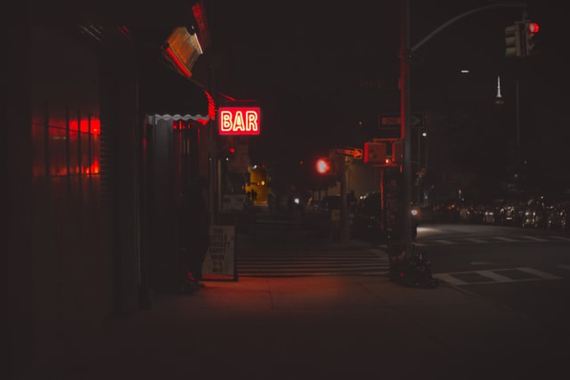
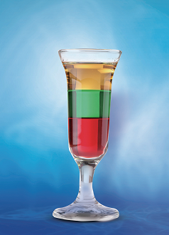

# 글쓰기 과제 [레벨4-시작] 
# Hello Night World

호주의 도시 멜버른에서 트램을 타고 30분 정도 남쪽으로 이동하면 도착하는 세인트 킬다라는 바닷가 도시에는 "HelloNightWorld" 라는 작은 바가 있다. 
매일 오후 8시에는 간판에 불이 켜지고 육중한 철제문을 열고 들어가면 보이는 세 개의 나무 테이블과 술병들. 
그리고 각 천장 귀퉁이에서는 매일 다른 음악이 흐르지만, 오늘은 여유로운 재즈로.

 

    

 

시끄러운 소리와 함께 두 명의 손님이 들어온다. 
둘은 서로 언성을 높이기까지 하며 테이블에 앉는다. 
서로 누가 맞는지를 대결하는 듯한 말씨. 잠시 들어보자. 
"아니 제임스! DTO는 서비스단까지 들어가면 안 된다니까!" 
이어서 다른 이의 한 마디. 
"그러면 그걸 일일이 컨트롤러에서 엔티티로 바꿔서 서비스로 넘겨줘야 한다는 거야...?" 
의문에 대한 다른 의문. 
"그렇다고 서비스에서 DTO를 바꿔주게 되면 DTO가 변경될 때마다 서비스 코드가 바뀌게 되지 않을까? 이러면 서비스가 쉽게 변경될 여지가 있다구!" 
두 사람의 논쟁은 주문을 잊은 듯 계속 이어졌다. 

시끄러운 테이블에서 벗어나 바를 돌아보니 토니는 술병들을 열어 칵테일을 만들고 있다. 
빠알간 그레나딘 시럽과 민트향 술 그리고 맛이 좋은 브랜디까지 층을 쌓는다. 
그리고 그 칵테일은 왁자지껄한 테이블로. 
"제임스, 여기 칵테일 한 잔 드릴게요. 푸스 카페라는 칵테일이에요. 두 분이 이야기하시는 레이어드 아키텍쳐처럼 층이 있죠." 
드디어 조용해진 바 안에서 두 사람은 의뭉스러운 눈빛으로 칵테일을 바라본다. 
"네.. 뭐 그렇네요."
 "지금 DTO에 대해서 논의하시는건 두분이 진행하시는 프로젝트에서 프레젠테이션 레이어를 그리고 어플리케이션 레이어를 어디까지로 보실지에 따라 달라질 거 같다는 생각이 드네요. 고민이 된다면 오늘은 즐겁게 한잔하시고 내일 출근해서 생각해보시는 것도 좋죠! 이 한잔은 서비스로 드릴게요." 
 "오.. 토니 감사해요. 맞다! 그리고 저희는 늘 마시던 거로 부탁드려요!"

 

    

 

토니는 주문받은 칵테일을 만들어 서빙하고 바 뒤편에 앉아 노트북을 켜놓고는 내일 회사에서 할 일들을 정리한다. 
아침에는 담당하고 있는 프로젝트 팀원들과의 스프린트가 있고, 아 내일 신입 개발자가 들어온다고 하니 점심에는 함께 스테이크를 먹고 커피도 한잔하기로. 
오후에는 성과 보고 회의에도 참여하고. 
이렇게 생각하다 보니 시간이 지나 어느덧 일을 도와주는 바텐더 친구 브라우니가 찾아왔다.  
토니는 자연스레 손님의 자리로 이동. 
달콤한 취기를 느끼며 하루를 마감하고 싶기에 [Memory Leak](https://github.com/cocktails-for-programmers/cocktails_for_programmers/blob/master/%ED%94%84%EB%A1%9C%EA%B7%B8%EB%9E%98%EB%A8%B8%EB%A5%BC_%EC%9C%84%ED%95%9C_%EC%B9%B5%ED%85%8C%EC%9D%BC.md#memory-leak) 이라는 칵테일을 한 잔. 
브라우니와 즐겁게 이야기를 나누다 보니 밤이 아쉬운 사람들이 하나둘 들어오고 덕분에 바 안은 북적북적. 
언제까지 자리를 차지하고 앉아 있을 수 없기에 빈 잔을 뒤로하고 철제문을 열고 나온다.

 

  
 

바 사진 출처 : https://unsplash.com/photos/V12QmVEMXlU  
칵테일 사진 출처 : https://www.beveragenews.co.kr/news_cocktail/1847
